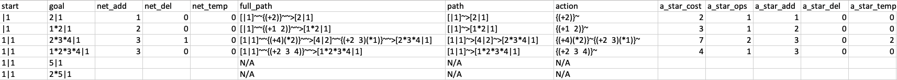

# EcologicalNavigation.jl

This repository contains code for the paper "Navigation between initial and desired community states using shortcuts", by Benjamin W. Blonder*, Michael H. Lim*, Zachary Sunberg, Claire Tomlin (* denotes equal contribution).
The repository is organized into three main parts, /scripts, /data, and /src.

## Scripts _(/scripts)_
Scripts folder should contain the relevant scripts that allow us to run the numerical experiments.
1. **Experiment Configs**: Before running the A* experiments, we need to set up the configurations for the numerical experiments. This can be done via _/scripts/helper/experiment_config.jl_. The file lets us specify saving data, parallelization, epsilon, costs, and dataset choices. 

    _Note:_ Parallelization is done on a dataset-epsilon level, since we must perform new sets of ODE integration for different dataset and epsilon choices, while other hyperparameters can be varied without re-integrating.

2. __A* Pathfinding Experiment__: In order to run the A* experiments, we can run the script _/scripts/AStar_sim.jl_ by the following:

       julia --project [path_to_EcologicalNavigation.jl]/scripts/AStar_sim.jl

    This will automatically save the data in _/data/results_. It will generate 5 different types of files under directory _/data/results/[Dataset Name]/[Datetime]/_: adjacency_df.csv, assemblage.csv, a_star.csv, summary.txt, transitions.csv.

### Example Outputs
Here are some previews of how the example outputs should look like:

**Assemblage** (assemblage.csv)

Notations:
- state: The binary abundance vector for which species are present
- x: The numeric abundance vector
- temp: Environment variable (temperature)
- str: String representation of the state, species combinations are denoted with "\*" and temperature is denoted with "|". For instance, a state with species 1, 2, 5 at temperature 1 would be denoted "1\*2\*5|1".
- stable, feasible, candidate: Boolean variables
- tau: max(1/eig) for A matrix
- richness: Number of species in the state
- Abundance mean/std: The mean/std abundance for existing species

**A\* results** (\[...\]\_a\_star.csv)

Notations:
- start, goal: The string representation of start and goal states
- net add, del, temp: Net difference between start and goal states
- full_path: The full path between the start and the goal, if exists. The states are denoted with "[]", and the actions are denoted with "{}" to more clearly separate the two. An example path snippet looks like "\[state1\]\~\~{action1}\~>\[state2\]".
- path: Only the state portion of the path. E.g. "\[state1\]\~>\[state2\]".
- action: Only the action portion of the path. E.g. "{action1}\~{action2}\~". The notation for actions is {(+ adds)(- dels)(* temp)}.
- a_star_cost: Total cost of the full A\* path
- a_star_ops: Number of A\* wait actions taken for the path
- a_star add, del, temp: Number of add, del, temp actions taken total for the path (individual species/env level).

## Data _(/data)_

The datasets are stored in _/data/dataset_, under different first author names. The respective experimental _A, r_ values are stored in *a_matrix.csv* and *r_vector.csv* files. The codebase currently contains all the experimental data used for the study: 

- Ciliate: "Maynard"
- Ciliate+environment3: "Maynard15-19-23"
- Ciliate+environment5: "Maynard15-17-19-21-23"
- Human gut: "Venturelli"
- Mouse gut: "Bucci"
- Protist: "Carrara"

It is also possible to add new dataset by following the file organization convention described above, as well as adding an entry in the _/scripts/helper/load_data.jl_ and _/scripts/helper/experiment_config.jl_ files.

## Source _(/source)_

The source folder contains the source code. The code has been formatted with function descriptions and comments to improve readability. The functions exported in _/src/EcologicalNavigation.jl_ can be called from outside this folder/package as well.
